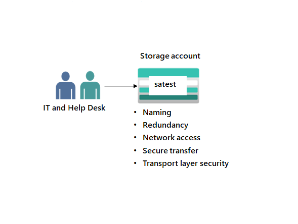

---
lab:
  title: 'Übung 01: Bereitstellen von Speicher für die Tests und Schulungen der IT-Abteilung'
  module: Guided Project - Azure Files and Azure Blobs
---

Die IT-Abteilung muss verschiedene Speicherszenarios entwickeln und neue Mitarbeiter*innen ausbilden. Der Inhalt ist nicht wichtig genug zum Sichern und muss nicht wiederhergestellt werden, wenn die Daten überschrieben oder entfernt werden. Gewünscht ist eine einfache Konfiguration, die leicht geändert werden kann.

## Architekturdiagramm

## Qualifikationsaufgabe
- Erstellen Sie ein Speicherkonto. 
- Konfigurieren Sie grundlegende Einstellungen für Sicherheit und Netzwerk. 

## Übungsanweisungen

## Erstellen einer Ressourcengruppe und eines Speicherkontos.

1. Erstellen Sie eine Ressourcengruppe für alle Ihre Projektressourcen und stellen Sie sie bereit. Weitere Informationen zu [Ressourcengruppen](https://learn.microsoft.com/azure/azure-resource-manager/management/manage-resource-groups-portal).
    - Suchen Sie im Azure-Portal die Option `Resource groups`, und wählen Sie sie aus.
    - Wählen Sie **+ Erstellen** aus.
    - Geben Sie Ihrer Ressourcengruppe einen **Namen**. Beispielsweise `storagerg`.
    - Wählen Sie eine **Region** aus. Verwenden Sie diese Region für das gesamte Projekt. 
    - Wählen Sie **Überprüfen und erstellen** aus, um die Ressourcengruppe zu überprüfen.
    - Wählen Sie **Erstellen** aus, um die Ressourcengruppe bereitzustellen.

1. Erstellen sie ein Speicherkonto, und stellen Sie es bereit, um Tests und Schulungen zu unterstützen. Lesen Sie mehr über die [Typen von Speicherkonten](https://learn.microsoft.com/azure/storage/common/storage-account-overview#types-of-storage-accounts).
    - Suchen Sie im Azure-Portal die Option `Storage accounts`, und wählen Sie sie aus. 
    - Wählen Sie **+ Erstellen** aus.
    - Wählen Sie auf der Registerkarte **Grundlagen** ihre **Ressourcengruppe** aus.
    - Geben Sie einen **Speicherkontonamen** an. Der Name des Speicherkontos muss in Azure eindeutig sein. 
    - Legen Sie die **Leistung** auf **Standard** fest. 
    - Wählen Sie **Überprüfen** und danach **Erstellen** aus. 
    - Warten Sie, bis das Speicherkonto bereitgestellt ist, und wählen Sie dann **Zu Ressource wechseln** aus.  

## Konfigurieren einfacher Einstellungen im Speicherkonto

1. Die Daten in diesem Speicherkonto erfordern keine Hochverfügbarkeit oder Dauerhaftigkeit. Eine kostengünstige Speicherlösung ist wünschenswert. Lesen Sie mehr über die [Redundanz von Speicherkonten](https://learn.microsoft.com/azure/storage/common/storage-redundancy#locally-redundant-storage).
    - Wählen Sie im Speicherkonto unter dem Abschnitt **Datenverwaltung** das Blatt **Redundanz** aus.
    - Wählen Sie **lokal redundanter Speicher (LRS)** in der Dropdownliste **Redundanz** aus. 
    - Klicken Sie auf **Speichern**, um die Änderungen zu speichern. 
    - Aktualisieren Sie die Seite. Der Inhalt ist nur am primären Standort vorhanden. 

1. Das Speicherkonto sollte nur Anforderungen von sicheren Verbindungen akzeptieren. Lesen Sie mehr zum [Voraussetzen sicherer Übertragungen von sicheren Verbindungen](https://learn.microsoft.com/azure/storage/common/storage-require-secure-transfer).
    - Wählen Sie im Abschnitt **Einstellungen** die Option **Konfiguration** aus.
    - Vergewissern Sie sich, dass die Einstellung **Sichere Übertragung erforderlich** auf **Aktiviert** festgelegt ist. 

1. Entwickler*innen wünschen sich, dass das Speicherkonto mindestens die TLS-Version 1.2 verwendet. Lesen Sie mehr über [Transport Layer Security (TLS)](https://learn.microsoft.com//azure/storage/common/transport-layer-security-configure-minimum-version?tabs=portal).
    - Wählen Sie im Abschnitt **Einstellungen** die Option **Konfiguration** aus.
    - Stellen Sie sicher, dass die **TLS-Mindestversion** auf **Version 1.2** festgelegt ist.  

1. Bis der Speicher wieder benötigt wird, deaktivieren Sie Anforderungen an das Speicherkonto. Lesen Sie mehr über die [Deaktivierung gemeinsam verwendeter Schlüssel](https://learn.microsoft.com/azure/storage/common/shared-key-authorization-prevent?tabs=portal#disable-shared-key-authorization).
    - Wählen Sie im Abschnitt **Einstellungen** die Option **Konfiguration** aus.
    - Stellen Sie sicher, dass für **Zugriff auf Speicherkontoschlüssel erlauben** die Option **Deaktiviert** festgelegt ist.
    - Klicken Sie auf **Speichern**, um die Änderungen zu speichern. 

1. Stellen Sie sicher, dass das Speicherkonto den öffentlichen Zugriff aus allen Netzwerken zulässt.  
    - Wählen Sie im Abschnitt **Sicherheit + Netzwerk** das Blatt **Netzwerk** aus.
    - Stellen Sie sicher, dass für **Zugriff über öffentliche Netzwerke** auf **Aktiviert aus allen Netzwerken** festgelegt ist.
    - Klicken Sie auf **Speichern**, um die Änderungen zu speichern. 

>**Hinweis**: Weitere Vorgehensweisen finden Sie im Modul [Erstellen eines Azure Storage-Kontos](https://learn.microsoft.com/training/modules/create-azure-storage-account/). Das Modul verfügt über eine Sandbox, in der Sie das Erstellen eines Speicherkontos üben können.
